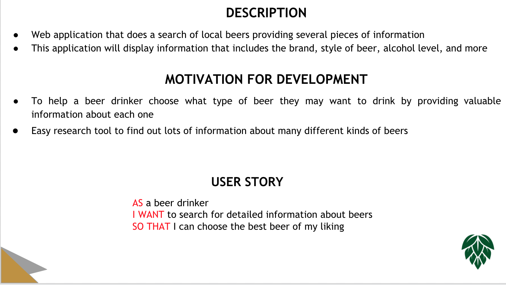
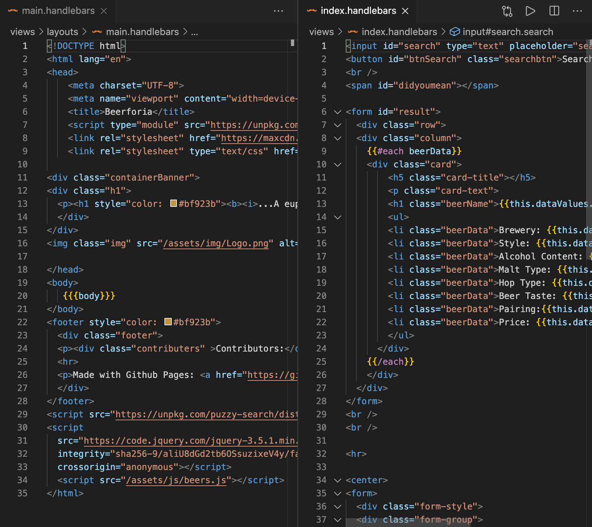
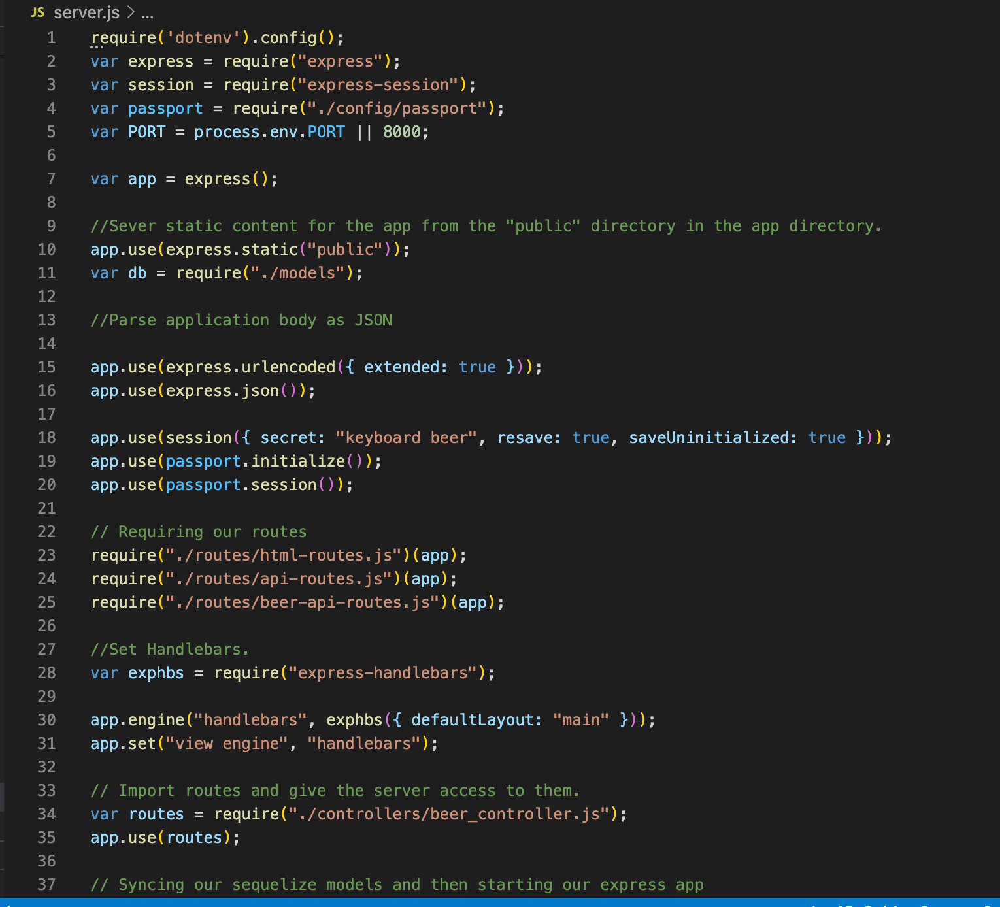

# BeerPhoria

The purpose of this application is to create a beer logger with MySQL, Node, Express, Handlebars, and Sequelize. This project will follow the MVC design pattern by using Node and MySQL to query and route data in the application, and Handlebars to generate the HTML.

# Project Description
To create an application that can be used to track beer selections and prefences that can be  viewed and remembered for future visits. Application will connect remotely to a Heroku database and will feature Node, Express, MySQL, Sequelize and Handlebars.

# Demo Features:
* The following images and gif shows the web application's appearance and functionality:

* User Story Prompts

* DB: Workbench from schema and seed files

* Config: config.json

* Model: beer.js 
  

* Demo gif

# Live URL:
<a href="hhttps://beerphoria.herokuapp.com//">BeerPhoria Heroku App</a>

<a href="https://github.com/sjohn214/BeerPhoria.git">BeerPhoria GitHub Repo</a>

<a href="https://youtu.be/f7_0ZW0zufY">BeerPhoria demo video</a>

# Summary

* In this project we created an application that will allow users to dynamically interact with a beer selection program. Users will "select" a beer "type beer name" and based on taste prefences view the results. A beer will be presented to reflect the user's selections. Future development for the application will include a "tab" style component that allows the user to retain a history of previous selections. As a bonus if time permits, application could feature a recommendation option for users who are unsure of what beers they prefer.

# Special Features:
* 2 html rendering Handlebars pages

  * main/index.handlebars
  
  

* 13 Javascript/Routes pages
  
  * server.js
  

* 1 Style Framework page
  * beer_style.css

# Special Features Continued:
  * mySQL is an open source relational database management system that is based on the structure query language "allowing the addition, removal and modification of an information database".
    * Schemas file
    * Seed file
  
  * Node is an open-source, cross-platform runtime environment that allows developers to create all kinds of server-side tools and applications in JavaScript.

  * Express is a popular node web framework library that is primarily responsible for handlers request "routes".

  * Handlebars is a logic-less templating engine that dynamically generates your HTML pages.

  * Sequelize is a mapping dependency that maps between model and a table methods and automatically add their attributes.

  * Inquirer is a collection of common interactive command line user interfaces.
  
  * Bcrypt.js is a npm package used most commonly to work with passwords in JavaScript.
  
  * Jquery is an open source JavaScript library that allows web developers to add extra functionality to their websites.

  * Public/Assests file holds style.css framework and beers.js
  
  * Controller file: holds Router application
  
  * Installed npm package-json, mysql, express-handlebars, express, sequelize, bcrypt.js, passport, inquirer, handlebars, etc.

# Authors/Contributors
* Jon Gudenzi (student) <a href="https://github.com/JonGudenzi">Git Hub Profile</a>
* Chris Havel (student) <a href="https://github.com/YachtRockGuy">Git Hub Profile</a>
* Shannondale Page (student) <a href="https://github.com/sjohn214">Git Hub Profile</a>
* Maddison Taitano (student) <a href="https://github.com/Maddisontaitano">Git Hub Profile</a>
* Austin Bruch (Bootcamp Instructor)
* Jon Jackson (Bootcamp TA Instructor)
* Daniel Sires (Bootcamp Tutor)