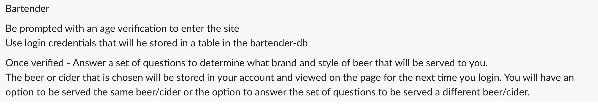
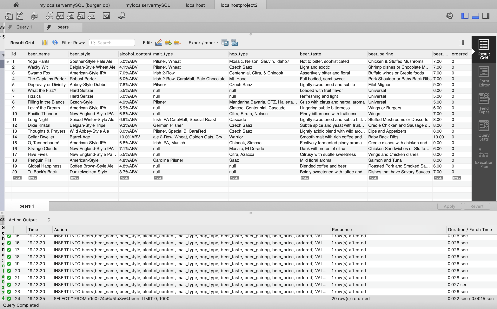
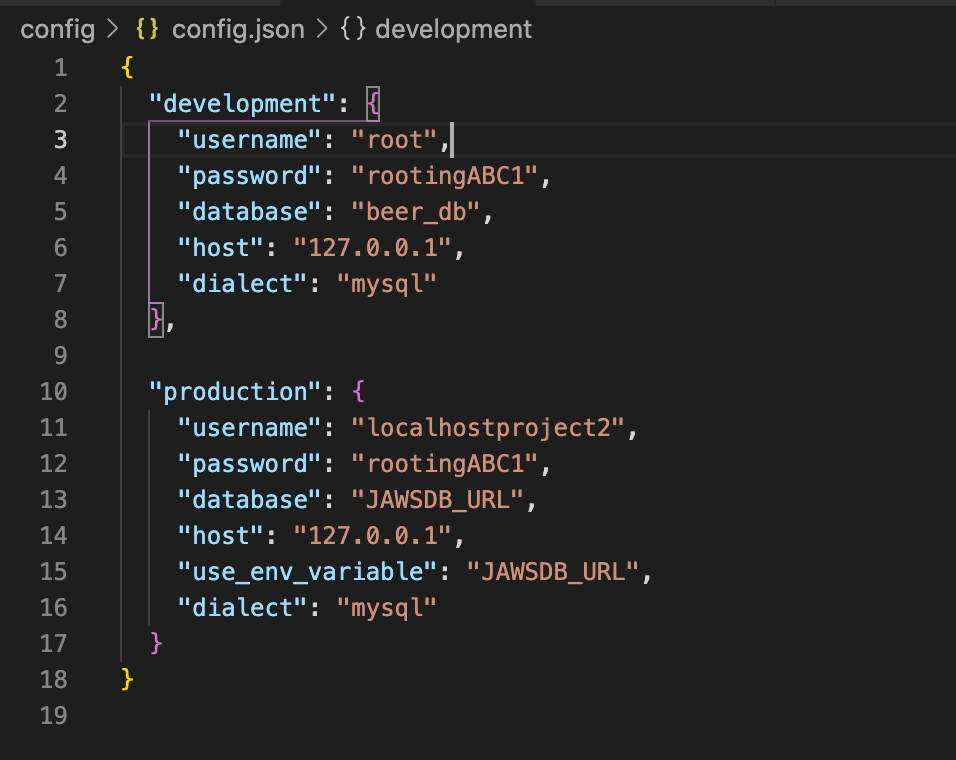
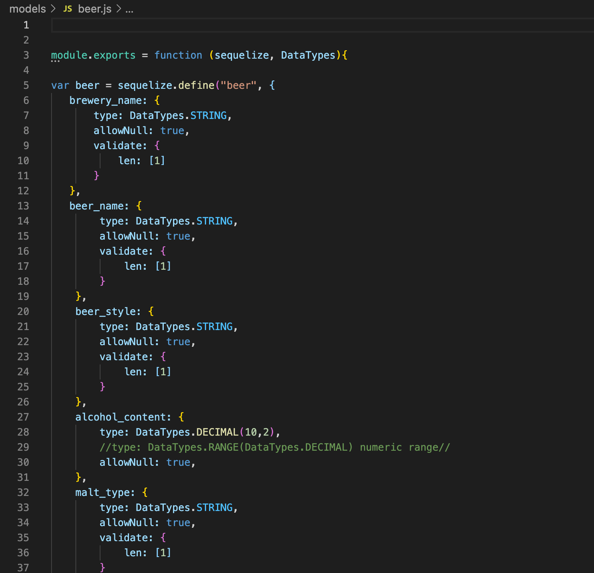

# BeerPhoria

The purpose of this application is to create a beer logger with MySQL, Node, Express, Handlebars, Sequelize and a homemade ORM. This project will follow the MVC design pattern by using Node and MySQL to query and route data in the application, and Handlebars to generate the HTML.

# Project Description
To create an application that can be used to track beef selections and prefences that can be ordered and remembered for future visits. Application will connect remotely to a Heroku database and will feature Node, Express, MySQL, Sequelize and Handlebars.

# Demo Features:
* The following images and gif shows the web application's appearance and functionality:

* User Story Prompts

* DB: sql files 

* Config: connection/orm.js

* Model: burger.js 
  

* Demo gif

# Live URL:
<a href="https://beerforia.herokuapp.com/">Beerforia Heroku App</a>

<a href="https://github.com/sjohn214/Beerforia">Beerforia GitHub Repo</a>

# Summary

* In this project we created an application that will allow users to dynamically interact with a beer selection program. Users will "select" options based on taste prefences and based on the results, a beer will be presented to reflect the user's selections. Application will include a "tab" style component that allows the user to retain a history of previous selections. As a bonus if time permits, application could feature a recommendation option for users who are unsure of what beers they prefer.

# Special Features:
* 2 html rendering Handlebars pages

  * main/index.handlebars
  
  

* 5 Javascript pages
  
  * server.js
  

* 1 Style Framework page
  * beer_style.css

# Special Features Continued:
  * mySQL
  * Express
  * Node
  * Handlebars
  * Sequelize
  * Inquirer
  * Bcrypt.js
  * Arrays with objects
  * Jquery language
  * Schemas file
  * Seed file
  * Assests file
  * Controller file: holds Router application
  * Functions
  * Installed npm package mysql, express-handlebars and express
  * Installed package-json

# Authors/Contributors
* Jon Gudenzi (student) <a href="https://github.com/JonGudenzi">Git Hub Profile</a>
* Chris Havel (student) <a href="https://github.com/YachtRockGuy">Git Hub Profile</a>
* Shannondale Page (student) <a href="https://github.com/sjohn214">Git Hub Profile</a>
* Maddison Taitano (student) <a href="https://github.com/Maddisontaitano">Git Hub Profile</a>
* Austin Bruch (Bootcamp Instructor)
* Jon Jackson (Bootcamp TA Instructor)
* Daniel Sires (Bootcamp Tutor)